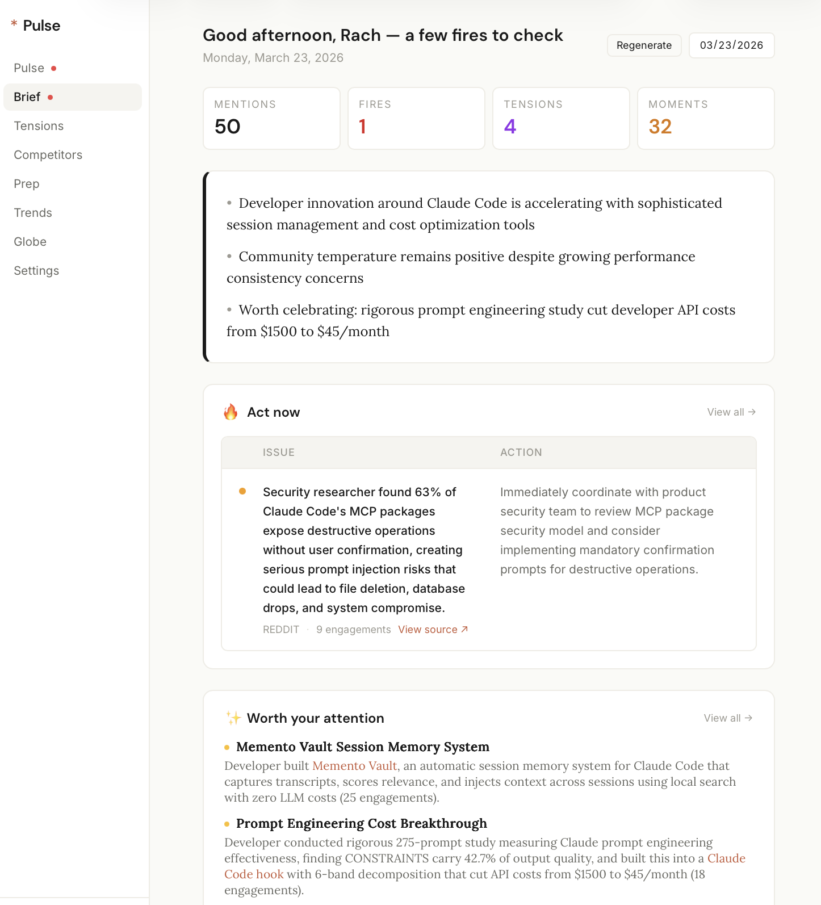

# Pulse

Developer comms intelligence. Monitors the platforms where developer sentiment actually forms, classifies every mention into actionable urgency tiers using Claude, and delivers triage-ready intelligence to a communications team.

**Classification accuracy:** 100% across 60+ mentions from HN, Reddit, and 32 RSS feeds. **Cost:** ~$40/month.

> 🔗 [Live dashboard](https://dailypulse-one.vercel.app/dashboard/brief)

> 🎥 [Demo](https://www.loom.com/share/3f3004ee19aa425fb030b72a5f46008d)

> 📝 [Design rationale & feature walkthrough (Notion)](https://www.notion.so/Pulse-32a152e1dde280f58a08ec68daf36d12?source=copy_link)
---

## Pulse in Action

#### Morning brief — three-section digest with fires, moments, and signals



#### Feed — real-time mentions with urgency classification, bookmarks, and triage filters


#### Tensions — hope × concern scatter plot with click-to-detail panel


#### Spokesperson prep — AI-generated briefing documents from accumulated intelligence


---

## What it does

Pulse ingests from 32+ sources every 30 minutes — Hacker News (Algolia API), Reddit (.json endpoints), YouTube (Data API v3), and RSS feeds spanning dev blogs, tech press, official channels, and research publications. Each mention passes through a Claude Sonnet classification pipeline that returns:

- **Urgency tier** — fire (respond in hours), moment (amplify within a day), signal (track over time), noise (log and ignore)
- **Hope and concern scores** — independent 0–3 axes, not binary sentiment. A developer who's excited about Claude Code but worried about skill decay scores high on both.
- **Tension type** — when hope ≥ 2 and concern ≥ 2, one of five named tensions: learning ↔ atrophy, empowerment ↔ displacement, time savings ↔ treadmill, decision support ↔ erosion, productivity ↔ dependency
- **Primary emotion** — 12 categories (excitement, frustration, fear, admiration, curiosity, skepticism, etc.) calibrated for developer language where "kill," "crash," and "fatal" are neutral technical terms
- **Recommended action** — one-line next step for the comms team
- **Competitor detection** — flags mentions of Cursor, Copilot, Gemini CLI, Codex, Windsurf, Devin, Replit Agent
- **Inferred region** — for regional sentiment analysis

The classifier uses 8 few-shot calibration examples grounded in real HN/Reddit posts, with categorical override rules (e.g., security bypass → always fire, community build → always moment) and intensity calibration based on SemEval-2018 affect research.

---

## Dashboard

| Page | What it answers |
|------|-----------------|
| **Feed** | "What's happening right now?" — filterable by urgency, source tier, time range, flags. Bookmark and flag mentions for triage workflow. |
| **Brief** | "What do I need to know this morning?" — three-section digest (Act now / Worth your attention / On the radar) with copy-to-Slack. |
| **Tensions** | "Where is developer sentiment conflicted?" — hope × concern scatter plot with click-to-detail panel. |
| **Competitors** | "What are developers saying about alternatives?" — mentions grouped by competitor with switching direction analysis. |
| **Prep** | "How do I prepare a spokesperson?" — generates briefing docs from accumulated intelligence: key messages, likely questions, landmines. |
| **Trends** | "Is the narrative getting better or worse?" — sentiment trend, coverage distribution by source tier, top topics with week-over-week change, fire frequency. |
| **Regional** | "Are different markets talking about different things?" — world map with per-region narrative summaries, topic breakdowns, and active fires. |

---

## Triage workflow

1. **Read** — scan the feed, sorted by urgency. Fire cards have red borders. Moments have amber.
2. **Save** — star mentions to bookmark them. Filter by "Bookmarked only" later.
3. **Route** — flag mentions as "Response needed," "Share with product," "Case study," or "Include in brief."
4. **Act** — generate a spokesperson prep doc, copy the brief to Slack, or draft a response.

---

## Architecture

```
Layer 1: Signal ingestion
  HN (Algolia) + Reddit (.json) + YouTube (Data API) + 32 RSS feeds
  → Cron every 30min via Vercel

Layer 2: Claude intelligence
  Claude Sonnet classifies each mention → urgency, emotion, tension,
  hope/concern, competitor, region, recommended action
  → Assistant prefill for reliable JSON parsing

Layer 3: Storage + enrichment
  Supabase Postgres → engagement velocity snapshots every 30min
  → Auto-promote to fire at 3× baseline engagement rate

Layer 4: Outputs
  Dashboard (Next.js 14) | Morning brief | Slack alerts | Prep docs
```

**Stack:** Next.js 14 (App Router), Supabase (Postgres + Auth), Claude API (Sonnet), Vercel (deploy + cron), Tailwind CSS

**Cost:** ~$40/month at 100 mentions/day (API classification + Vercel + Supabase free tier)

---

## Research grounding

The classification system is informed by a developer comms intelligence market analysis compiled from 778 sources, plus:

- **Anthropic's 81K economic study** — hope and alarm coexist; someone excited about a benefit is 3× more likely to also fear the associated harm
- **Scherer's Component Process Model** — independent appraisal dimensions producing mixed emotional states
- **Stack Overflow Emotion Gold Standard** (Novielli et al.) — credibility inversely correlated with emotional intensity in developer text
- **Developer sentiment literature** (arXiv:2105.02703) — off-the-shelf sentiment tools perform poorly on developer language, necessitating domain-specific approaches
- **Cascade dynamics** (Goel, Anderson, Hofman, Watts) — early engagement breadth predicts virality; 99% of cascades terminate within one generation

Full market analysis of 14+ monitoring tools (Brandwatch, Meltwater, Common Room, Octolens, Syften, etc.) available in the Notion walkthrough.

---

## Roadmap (Ship in Next 30 Days)

- **X/Twitter integration** — add the highest-volume developer sentiment platform as a source tier
- **Slack bot with real-time fire alerts** — push notifications to the right channel the moment a fire is detected, not on the next cron cycle
- **Draft from selection** — select multiple mentions, generate a response draft, internal brief, or cross-functional report directly from the selected sources using Claude
- **Message pull-through tracker** — compare Anthropic's intended narratives against actual press coverage to measure whether key messages are landing
- **Weekly intelligence digest** — auto-generated summary of fires fought, narratives tracked, and sentiment shifts, with resolution status for closed fires
- **Cross-functional routing** — automatically surface product feedback to engineering, competitive intelligence to product, and security concerns to the security team


---

## Setup

### Prerequisites

Node.js 18+, Supabase project, Anthropic API key.

### Environment

```bash
cp .env.example .env.local
```

```
NEXT_PUBLIC_SUPABASE_URL=
NEXT_PUBLIC_SUPABASE_ANON_KEY=
SUPABASE_SERVICE_ROLE_KEY=
ANTHROPIC_API_KEY=
CRON_SECRET=
YOUTUBE_API_KEY=          # optional
SLACK_WEBHOOK_URL=        # optional
```

### Database

Run migrations in order:

```sql
supabase/migrations/001_initial.sql
supabase/migrations/002_prep_documents.sql
```

### Run

```bash
npm install
npm run dev
```

### Ingest and classify

```bash
curl -X POST http://localhost:3001/api/ingest/hackernews
curl -X POST http://localhost:3001/api/ingest/reddit
curl -X POST http://localhost:3001/api/ingest/rss
curl -X POST http://localhost:3001/api/classify
curl -X POST http://localhost:3001/api/velocity
curl -X POST http://localhost:3001/api/brief
```

### Deploy

Deploy to Vercel. Set environment variables. The cron schedule is configured in `vercel.json`.

---

## API

| Route | Method | Description |
|-------|--------|-------------|
| `/api/cron` | POST | Full pipeline: ingest → classify → velocity → alerts → brief |
| `/api/ingest` | POST | All source ingestions |
| `/api/ingest/hackernews` | POST | HN only |
| `/api/ingest/reddit` | POST | Reddit only |
| `/api/ingest/rss` | POST | RSS feeds only |
| `/api/classify` | POST | Classify unclassified mentions via Claude |
| `/api/velocity` | POST | Engagement velocity snapshots |
| `/api/brief` | POST | Generate daily brief |
| `/api/mentions` | GET | Filtered, paginated mention feed |
| `/api/mentions/[id]` | PATCH | Update bookmark, flag, review status |
| `/api/prep` | POST/GET | Generate or list spokesperson prep documents |

---

*Built with Claude Code. 5 parallel agents. 1 week.*